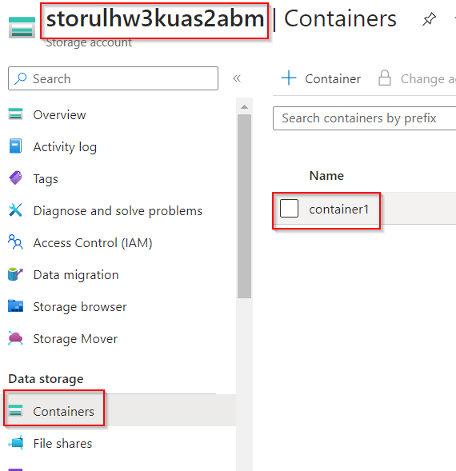

# Snapshot an Azure VM Disk using PowerShell

**There are 3 objectives with this lab:**
* Stop the Virtual Machine
* Take a Snapshot of the VM
* Copy the Snapshot to Container

## Stop the Virtual Machine

In the first part of the lab, we have to stop the virtual machine but we're also going to assign a bunch of variables to make our lives easier. The first thing I want you to do is navigate to the storage account and to Container `container1`. Click on `container1` and notice that it's empty. I say this 

Click on `container1` and notice that it's empty. I say this because you won't really know if you completed the lab when you're done because you wouldn't know the container was empty in the first place. So this is our benchmark. 

Now, lets go into the Azure CLI using PowerShell. Don't forget to create a storage account and file share using the Show advanced settings option when you get there. Once here, we have to input the commands given in the lab. I'll explain each command:

This command will make a variable for our resource group (RG) so that we don't have to keep putting this information in. RGs can have long and complex naming structures so to avoid human error, it's better to just assign it to a variable. 
`$rg = "432-917c3dd8-snapshot-an-azure-vm-disk-using-power"`

This command does the same thing but for the data disk attached to the virtual machine (VM) we're going to stop.
`$diskname = "winVM_disk1_c5e5fa6625174bb7b9b0bd7352d3f312"`

I believe this command sets an expiration timeer of 1 hour to the storage access signature (SAS). You don't want these access resources to be used for a prolonged period of time. It presents security issues. 
`$sasExpiryDuration = "3600"`

We made a variable for the storage account. Same as the RG.
`$storageAccountName = "storulhw3kuas2abm"`

This is the access key to the storage account above. To find this key, navigate to the storage account. Go to Security + networking > Access keys. We're going to use the key for `key1` so Show and then Copy + Paste the string. 
`$storageAccountKey = "yOvMemKx8bZJMfcaTheb/qLJnPxLWoUas6iuiWlO7O82TlZC/QzUJciHrkXiR1h+iBTqou18ebGR+AStc6Ermg=="`

This commands make additional variables that we will need in the upcoming PowerShell (PS) commands. 
`$storageContainerName = "container1"`
`$destinationVHDFileName = "disk1.vhd"`
`$useAzCopy = 1`
`$vmName = "winVM"`

This cmdlet actually stops the VM.
`Stop-AzVM -ResourceGroupName $rg -Name $vmName`

Once you put all of these commands in PS, you should be prompted with a Yes or No question as to if you really want to stop your VM. Choose Y. 

You can further check if your VM stopped by going to the VM in the portal and seeing the options at the top. You should have a Start button and you shouldn't be able to access the Stop button.

That is the first part of this lab. Lets move onto the second portion. 

## Take a Snapshot of the VM

For the second portion of this lab, we're going to actually take the snapshot of the VM using PS. So we already created all of the variables so we can just copy and paste the commands given to us in the lab into PS. I'll explain each command to the best of my ability. 

`$sas = Grant-AzDiskAccess -ResourceGroupName $rg -DiskName $diskName -DurationInSecond $sasExpiryDuration -Access Read`

`$destinationContext = New-AzStorageContext -StorageAccountName $storageAccountName -StorageAccountKey $storageAccountKey`

Lets move to the final portion of this lab!

## Copy the Snapshot to Container

In the last part of this lab, we'll copy the snapshot that we took to the container we observed in the first part of this lab. Once again, we've already created the variables for each command so we'll copy and paste the commands that are listed in the lab. I won't paste the next part of the code in here because it just won't look right but there's basically an else-if loop that we run that will. I don't understand every single part of the code but I get the overall gist of what's happening. 

This copy process will take a few minutes. Maybe even 15 minutes. Once it's done, navigate back to `container1` and you should see the snapshot there!

Lab completed!

## Personal Notes

This was a copy and paste lab. I wish I could say I came up with the lines of code myself but I didn't. I think this lab highlights the importance of automation though! A few variables can make this whole process A LOT easier. 

